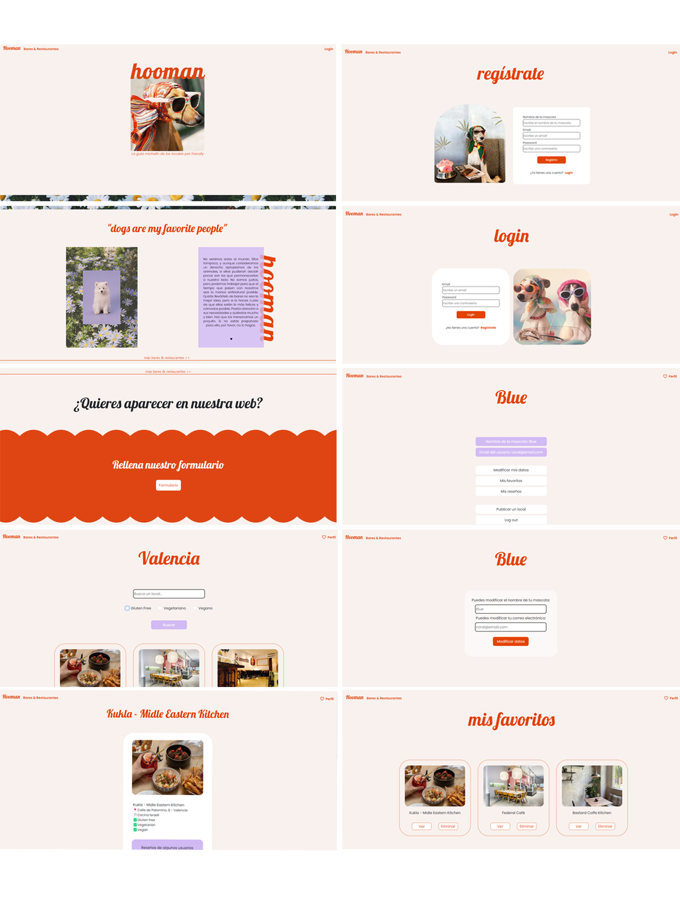

<h3 align="center"> ✨ HOOMAN ✨</h3>

---

  
<b>Índice</b> 📝

  <ol>
    <li><a href="#proyecto">Proyecto</a></li>
    <li><a href="#stack">Stack</a></li>
    <li><a href="#vistas">Vistas</a></li>
    <li><a href="#Proceso">Proceso</a></li>
    <li><a href="#licencia">Licencia</a></li>
    <li><a href="#agradecimientos">Agradecimientos</a></li>
  </ol>

#### Proyecto

Es una evidencia que cada vez son más las familias multiespecie, hay cada vez más conciencia de lo que supone la decisión de convivir con un animal y la adaptación que debemos hacer de nuestras vidas para que éstos animales no vivan bajo el estrés que la vida humana muchas veces les impone. 
Hooman será una herramienta más para que éstas familias tengan la posibilidad de convivir también con las mismas oportunidades y encuentren sitios en los que se les permita estar sin ningúna excepción. Cada vez existen más espacios adaptados a la convivencia animal, pero es difícil encontrarlos y de hacerlo, no siempre es justo lo que te apetece. La aplicación pretende facilitar éste trámite y dar opciones.
Este es el último proyecto realizado para el Bootcamp de Full Stack Developer en GeeksHubs Academy. 

Échale un vistazo a mi backend que le he dado mucho amor perruno: [HOOMAN](https://github.com/Coral-JM/cjm_fsd_backend_hooman_proyecto_final)

---
#### Stack 

---

#### Vistas
Si quieres echarle un ojo al proyecto en un vídeo haz click aquí: [YouTube](https://youtu.be/c65sPYwc4K4)

---

#### Proceso

Para este proyecto contábamos con dos semanas para realizar la base de datos, la API y el frontend. Para ello he usado PHP y Laravel por primera vez para toda la parte del backend y el frontend con mis ya grandes amigos: React y Redux. Durante el proceso he usado Postman para hacer las consultas a la api antes de introducir lo necesario para ello en el frontend. Finalmente, para el deploy he usado Railway para la base de datos de MySQL y Vercel para el resto de la aplicación, creo que esta ha sido la parte más complicada del proyecto. Ha sido un proceso divertido y distinto a todo lo anterior ya que era el primer proyecto de temática libre y siempre es motivante hacer un proyecto con un sentido más personal y a pesar del tiempo le he podido dar mucho mimo. Quizás esto ha sido la parte más fundamental para que ahora pueda decir que PHP se ha convertido en uno de mis stacks favoritos.

---
#### Licencia

Este proyecto ha sido realizado por Coral Jiménez, estudiante de GeeksHubs Academy en la promoción de primavera del 2023 y cuenta con una MIT License.

---
#### Agradecimientos

Llegados a este punto, no puedo no mencionar a Judit, sin duda ha sido mi mayor apoyo durante todos estos meses. Una tía chulísima y una persona preciosa. Desde luego este volantazo que decidí dar hace unos meses ya ha valido la pena solo por todas las risas y llantos que hemos pasado. 

En cuanto a mi, sin creerme aún todo lo que he conseguido, aquí estoy. Un abrazo a la Coral del pasado que llena de inseguridades decidió confiar un poquito en ella y dar el paso que le ha llevado a este nuevo mundo, que me está enamorando cada día un poco más. 

**Judit Grau** 

